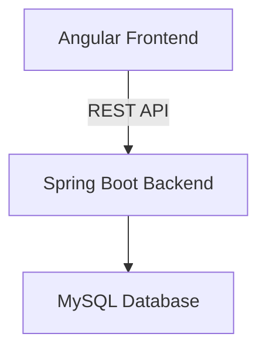

# Oral Health Surveillance System (OHSS)

The Oral Health Surveillance System (OHSS) is a web-based tool designed for teams of doctors to visit schools, collect oral health data, and (in future versions) perform data analysis. Currently, the application enables efficient data retrieval and management from multiple schools by multiple examiners. Data analysis features are planned for future version.


## Purpose

OHSS is designed for two main roles:

- **Doctors:** Visit schools and collect oral health data using the system.
- **Admin:** Manage doctor accounts and, perform data analysis on the collected data.

## Features

### Doctor
- Login authentication
- Register school visit
- Add student oral health records
- Edit or delete records

### Admin
- Create doctor accounts
- Manage doctors
- Monitor system usage


## Architecture



## Getting Started

### Prerequisites
- [Docker](https://www.docker.com/get-started)
- [Docker Compose](https://docs.docker.com/compose/install/)

### Setup

1. Clone the repository:
   ```bash
   git clone <repo-url>
   cd ohss
   ```

2. Create a `.env` file in the root directory using the provided template:
   ```bash
   cp .env.example .env
   ```
   Then fill in your values:
   ```env
   MYSQL_DATABASE=ohss
   MYSQL_ROOT_PASSWORD= ...
   DB_USERNAME= ...
   DB_PASSWORD= ...
   JWT_SECRET= ...
   ```
   > 💡 Generate a strong JWT secret with: `openssl rand -base64 32`

3. Build and start the application:
   ```bash
   docker compose up --build
   ```

4. Access the application:
   - **Frontend:** http://localhost:4200
   - **Backend:** http://localhost:8080

### Stopping the Application
```bash
docker compose down
```

To also remove the database volume:
```bash
docker compose down -v
```

## Directory Structure

- `ohss-backend/` — Spring Boot backend (Java)
- `ohss-frontend/` — Angular frontend (TypeScript)